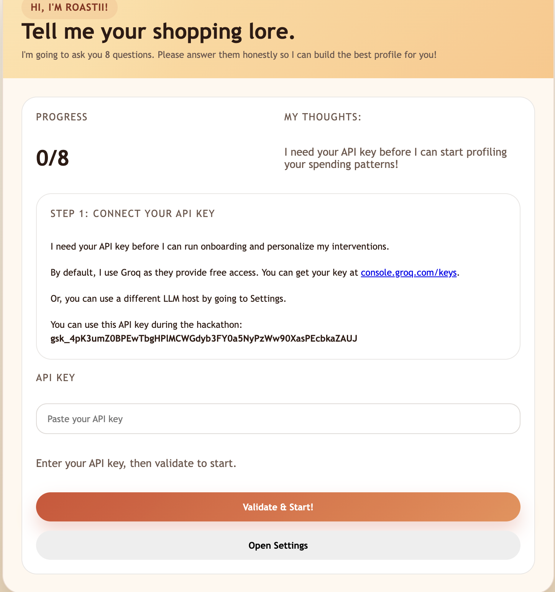

# Roastii -- Roast My Receipts!

A project by James and Benz for GenAI Genesis 2026.

This is a Chrome Extension that empowers a user's online shopping experience through the integration of a shopping critique agent!

## What is Roastii?
Roastii is an adorable AI companion wrapped into a Chrome Extension. Upon installing, she asks for your *shopping lore*, prompting you to complete a few questions so that she can build a profile on your financial status and needs. An example question would be, **"Which of these brands/categories makes your wallet cry?"**
After completing the profile, you can feel free to start shopping on [Amazon.ca](https://www.amazon.ca). When you add an item to your cart, Roastii will pop up and roast your decisions!
Past roasts will be saved, allowing for dynamic improvement of roasting as she monitors your habits.

## How to install Roastii?
+ Click on Release, download the latest zip of build. Unzip the downloaded zip file. 
+ Open your Chromium based browser (Chrome, Edge, Etc.)
+ Open your Extension Setting by opening <chrome://extensions/> or <edge://extensions/> based on your browser
+ Click on the Top Right Corner to enable `deverloper mode`
+ Click on `Load unpacked` to load the unziped folder
+ Open the page that sets up the API, and then answer the following questions  
+ You are good to go! Think twice before you made any purchase!